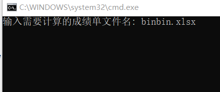

# 介绍
这个程序可以用来计算您的每个学期的加权平均成绩和绩点。

您需要配置[Python](https://python.org)环境，并安装pandas库以运行程序。

安装pandas库指令：`pip install pandas`
# 使用教程
1. 将程序(`.py`与`.bat`文件)与成绩单(`.xlsx`格式)放进同一文件夹。
   
   
2. 运行`GPAcalc.bat`，在指令界面输入成绩单的文件名称(包括后缀名)。
   
   
3. 输入`y`或`n`选择是否计算通识选修课成绩。
   
   
4. 查看结果。
   
   

***
*made by littlebinn in python/markdown*